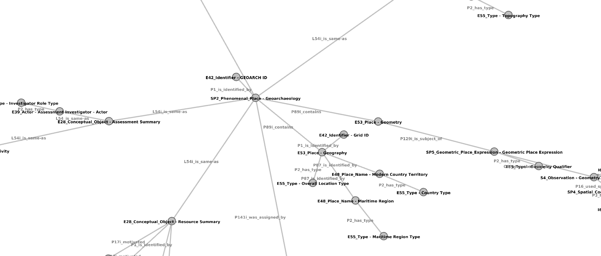
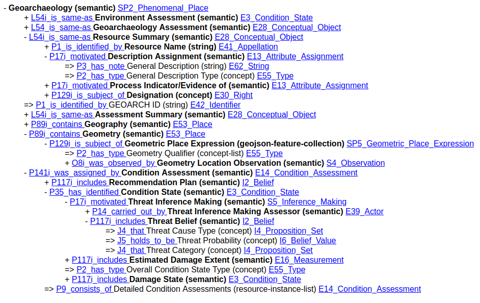
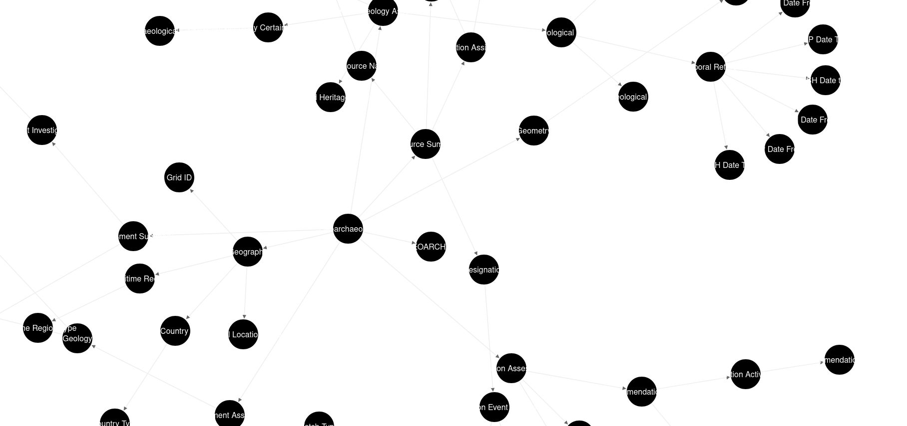

# Arches Graph Parser

Generates interactive HTML graph visualizations and Gephi files from Arches resource models (RM). Allow to [compare](https://github.com/achp-project/cultural-heritage/blob/main/graph-parser/README.md#using-the-graph-comparator) RM.
Supports single local file loading (with wildcard support) as well as remote URL loading.

## Version

Tested under the following versions:
* Python 3.8
* Arches 7.3 Exported Graph JSON files


## Installing env & dependencies

To build env from **settings.txt**:

```
# Supports paths for env
python -m venv newEnv
# Go into the graph parser directory
cd cultural-heritage/graph-parser
source newEnv/bin/activate
pip install -r requirements.txt
```

## Running the Parser

The parser can be run for a single file in the local filesystem.
For instance, to load the sample MAPHSA toy model:
```
python graph_parser.py "sourceGraphData/MAPHSA/MAPHSA Heritage Item.json"

```
This command will generate the output HTML and Gephi files, as well as the HTML dependencies, in the current directory.
To control the output placement, the parameter -o can be used:
```
python graph_parser.py "sourceGraphData/MAPHSA/MAPHSA Heritage Item.json" -o output/MAPHSA
```
This allows to place all the output in the provided directory.

### Batch Processing

Alternatively, the wildcard operator can be used to generate for all JSON in the same folder.
If several graph files were present in the same location, this command would process them simultaneously:
```
python graph_parser.py sourceGraphData/EAMENA/*.json -o output/EAMENA
```

### Remote Graph Load

The parser also supports loading through a textual URL as shown in the next example:
```
python graph_parser.py https://github.com/achp-project/prj-mapss/blob/main/pkg/graphs/Geoarchaeology.json -o output/MAPPS
```
Note that this mode does not support multiple URLs to be batch processed at the moment.

### Command Line Interface Help
This would work if the [JSON data for the EAMENA graphs](https://github.com/achp-project/prj-eamena-marea/tree/main/resource_models) is placed in the provided folder.

The help message for the CLI interface can also be read by running with the -h parameter.
```
python graph_parser.py -h

usage: graph_parser.py [-h] [-w [W]] [-o [O]] [input_files [input_files ...]]

positional arguments:
  input_files  local input graph files

optional arguments:
  -h, --help   show this help message and exit
  -w [W]       remote input graph files
  -o [O]       output folder

```

## Output Graphs

The parser currently generates three distinct outputs:

* An unordered [Gephi](https://gephi.org/) .gexf file
* An interactive collapsible list tree with links
* A dynamic force collapsible tree (not very readable yet)

### Gephi File

The current output .gexf file is unordered and hardly useful until ordered.


To make it slightly more manageable, some recommended steps include:
1. [Apply a Layout (for instance Yifan Hu)](https://subscription.packtpub.com/book/big-data-/9781783987405/3/ch03lvl1sec43/using-the-yifan-hu-multilevel-layout-algorithm)
2. [Enable node and edge labels](https://gephi.org/tutorials/gephi-tutorial-quick_start.pdf)

This should make the visualization informative and usable to a certain extent:

Remember that zooming, scrolling and dragging nodes can help in making sense of the network.

### Collapsible list Tree

The list contains a simple hierarchical view of the model with the links to the CIDOC classes for each node.
**To open and collapse node right click is necessary**



### Dynamic Force Tree

Shows all nodes and allows to collapse them with a simple click.
This visualization is currently work in progress, its lack of styling and interactions renders it mostly useless.


## Examples

Here are some exaples in case you want to skip ahead and see results generated with the parser:
* [EAMENA's Heritage Place circa 06/06/23](docs/sampleOutput/EAMENA_Heritage%20Place.html)
* [MAPPS's Geoarchaeology circa 06/06/23](docs/sampleOutput/MAPPS_Geoarchaeology.html)
